# Offline-gen

Offline Generator of Concourse pipelines

# Motivation
There are situations where online access is not permitted or allowed. This implies Concourse pipelines would be unable to download Github resources, docker images, Pivotal Tiles and other artifacts from online sources in such airgapped environments. Added complexity is that concourse pipeline are built around using docker images for running its tasks and hence each of the pipeline tasks would have to be modified to use a cached docker tarball (as well as saving those docker images locally). This requires manual creation of offline specific tasks and pipelines.

The motivation of this tool is to alleviate the problem of tracking down and saving the online resources into Blobstores, creating and maintaining manually a different set of pipelines that refer to these offlined resources. Rather use a tool to automatically harvest the resources referred in a pipeline into a S3 compatible Blobstore, generate the offline pipeline that refers to these saved artifacts and allow execution in isolated/offline mode.

# Overview
Generate two separate pipelines that handle:
* Blob Upload pipeline: upload of all the contents referred by a concourse pipeline to S3 Blobstore
  * Github repositories
  * Docker images (as tarballs)
  * Files or nested folders (as tarballs for multiple files)
  * Pivnet Tiles (with stemcells)
  * Non-Pivnet Tiles (like Ops Mgr Ova file)
* Offline Pipeline: uses only offlined version of resources saved in S3 Blobstore

 * Offline-gen Design
<div>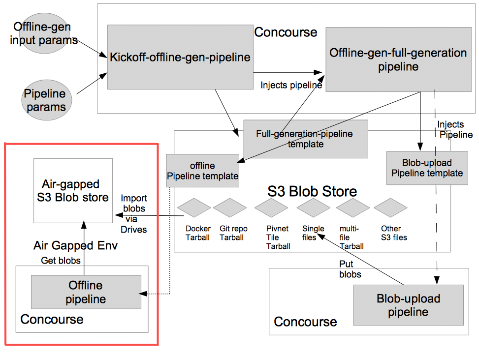</div>

The tool requires a S3 compatible blobstore like minio to be running and accessible from the concourse pipelines.

The generated offline and blobstore pipelines would refer to parameterized s3 blobstore to store and save artifacts.

The Offline-gen and Blob Upstore pipeline are both expected to run in an online environment so they can grab down resources they are dependent on (for offline-gen) or save them into the S3 blobstore (as for blob-upload pipeline). The offline-gen does not require specifying the version of tiles or products etc. The blob upload pipeline does require them to save the correct version into the blobstore.

Once the blobs have been saved into a blobstore, these can be exported and imported into a different S3 blobstore. The generated pipeline templates would be saved  along with the blobs under <run-id>/resources/offline-gen/<offline|blobstore-upload>-<pipeline-name>.yml
<div>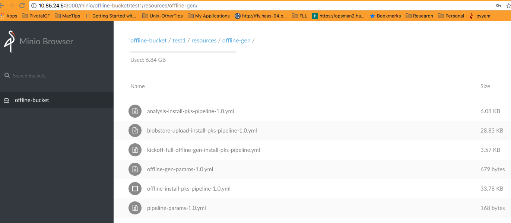</div>

The airgapped environment is expected to have minimally a Concourse Execution environment along with the exported Blobstore artifacts expected by the offline pipeline.

The offline pipeline can then be run by pointing to the cached S3 blobstore artifacts to execute the target pipeline in the airgapped environment without reaching outside.

# Running as a Concourse pipeline

Register the offline-gen pipeline with Concourse (requires basic auth to kick off other dependent pipelines). A Blobstore upload pipeline and offline versioned form of the actual pipeline would be generated.

```
# Concourse target
export CONCOURSE_TARGET=concourse-test

# MODIFY based on run/target pipeline
export OFFLINE_GEN_PIPELINE_NAME=kickoff-offline-gen-test-pipeline

# Use the provided kickoff-offline-gen-pipeline.yml template
export OFFLINE_GEN_PIPELINE=kickoff-offline-gen-pipeline.yml

# All offline-gen parameters go here (like s3 blobstore details, run name,
#                                 target pipeline github repo, pipeline file)
export OFFLINE_GEN_INPUT_PARAM_FILE=offline-gen-input-params.yml

# Any additional target pipeline parameters go here (like github branches)
export TARGET_PIPELINE_INPUT_PARAM_FILE=target-pipeline-params.yml

fly -t $CONCOURSE_TARGET set-pipeline \
    -p $OFFLINE_GEN_PIPELINE_NAME \
    -c $OFFLINE_GEN_PIPELINE \
    -y "offline_gen_yaml_input_params=$(cat $OFFLINE_GEN_INPUT_PARAM_FILE)" \
    -y "pipeline_yaml_input_params=$(cat $TARGET_PIPELINE_INPUT_PARAM_FILE)" \
    -l $OFFLINE_GEN_INPUT_PARAM_FILE \
    -l $TARGET_PIPELINE_INPUT_PARAM_FILE
```

Use the `sample_input.yml` to create a new input file that would contain configs for talking to a S3 Blobstore, name, branch, github repo of the target pipeline and associated pipeline that needs to be offlined. The pipeline-params file can contain parameter values pertaining to the target pipeline itself (IaaS/branch etc).

Parameters specified in the pipelines would be preserved as is.

# Using minio as a S3 Blobstore

Use [minio](https://minio.io/downloads.html) as a S3 compatible Blobstore:
```
#!/bin/bash

# Create a datastore folder
mkdir ./minio-data     

# Set up access keys  
export MINIO_ACCESS_KEY=my_access_id
export MINIO_SECRET_KEY=my_secret_access_key

# Set some listen address
export SERVER_ENDPOINT=<SERVER_IP>:9000

# Start the minio server
nohup ./minio server --address $SERVER_ENDPOINT ./minio-data &
```
Or if planning to use docker images of minio, use:
```
mkdir minio-data config
docker run -d -p 9000:9000 -e MINIO_ACCESS_KEY=my_access_id -e MINIO_SECRET_KEY=my_secret_access_key -v $PWD/minio-data:/data -v $PWD/config:/root/.minio minio/minio server /data
```

Check the output to match the keys specified.
Sample output for docker image:
```
Created minio configuration file successfully at /root/.minio

Endpoint:  http://172.17.0.2:9000  http://127.0.0.1:9000
AccessKey: my_access_id
SecretKey: my_secret_access_key

Browser Access:
   http://172.17.0.2:9000  http://127.0.0.1:9000

Command-line Access: https://docs.minio.io/docs/minio-client-quickstart-guide
   $ mc config host add myminio http://172.17.0.2:9000 my_access_id my_secret_access_key

```

Download minio client [mc](https://minio.io/downloads.html#download-client) and use that to create a minio bucket
```
# Register with a local minio server as local
mc config host add local http://localhost:9000 my_access_id my_secret_access_key

# Create a bucket on local minio server
mc mb local/offline-bucket
# List the bucket
mc ls local/offline-bucket

# Registering from a remote client
mc config host add remote http://$SERVER_IP:9000 my_access_id my_secret_access_key

# Create new offline-bucket2
mc mb remote/offline-bucket2
```
Make sure the bucket name does not contain `_` character.
Edit the input param settings to use the minio access keys.

Also, if no env variables are provided, then minio would use randomly generated values for the keys. The input parameter file should contain the correct keys for offline-gen to work.

Note: minio does not support auto file versioning unlike AWS S3. So, the offline-gen tool uses regexp to specify matching files.

# Stages

* Register the `kickoff-offline-gen-pipeline.yml` pipeline
  * Init
  <div>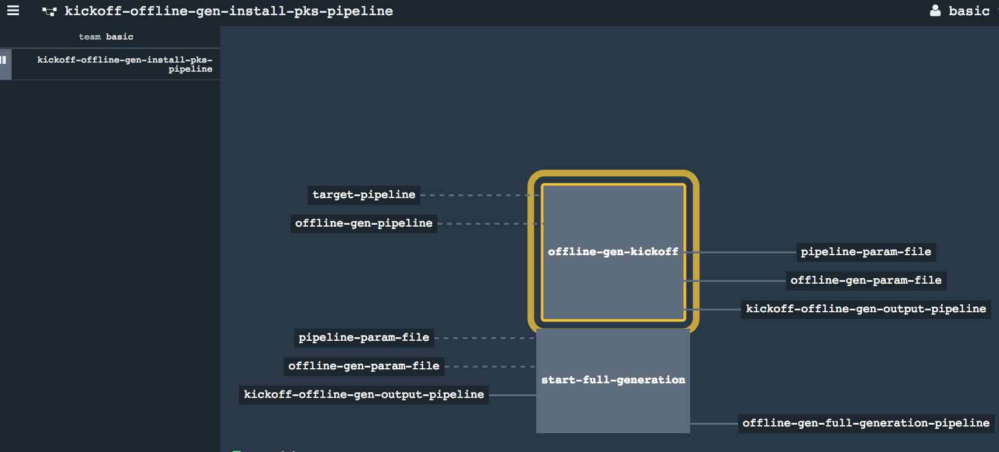</div>

* Execution of the kickoff pipeline would inject a new pipeline for handling full generation of the blobstore upload and offlined pipelines.
  * Start of registering full Generation
  <div>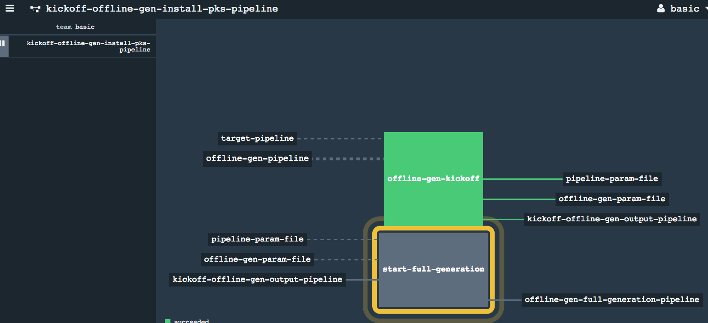</div>
  * Kickoff Complete
  <div>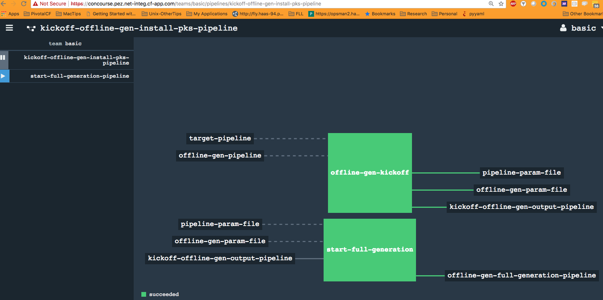</div>
  * Refresh the concourse browser page and check for new pipeline registered on the left hand panel
  * Newly injected `full generation` pipeline in paused state
  <div>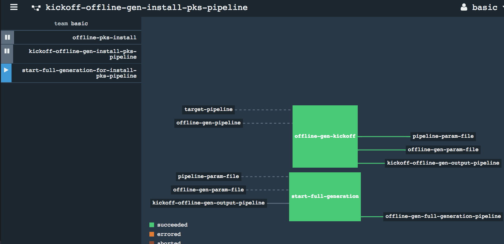</div>
  * Un-pause the full generation pipeline
  * Kickoff full offline generation pipeline
  <div>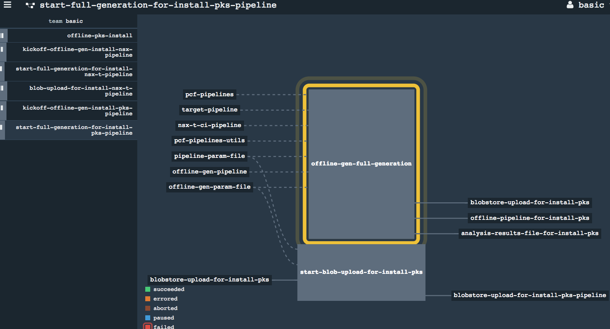</div>
  * New Blobstore upload pipeline injected
  <div>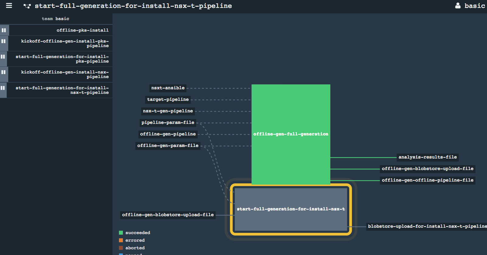</div>

  * Full Generation of upload and offline pipelines
  <div></div>

* S3 buckets would be filled with requisite files required for the offline-gen to function (parameter files, settings)
    * S3 Blobstore
    <div>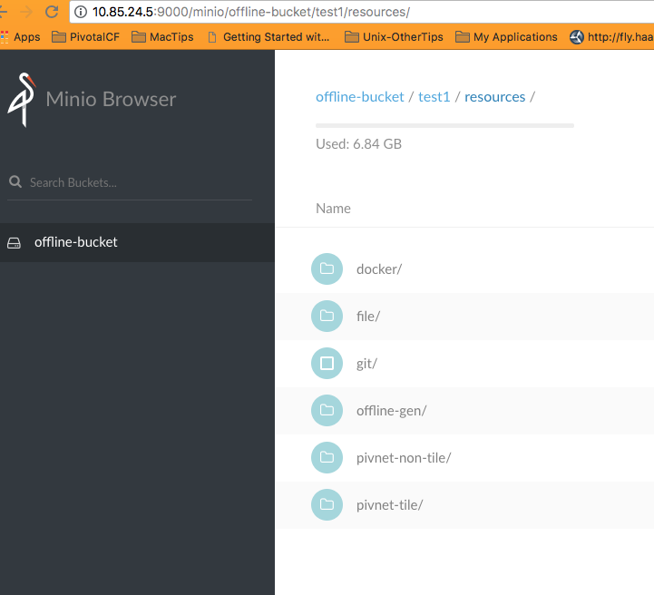</div>
    * S3 Blobstore Structure
    <div></div>

* Blobstore upload pipeline would be saved along with the offline version of the target pipeline
    * S3 Blobstore Upload and Offline pipelines
    <div></div>

* Running the blobstore upload pipeline would then upload all resources/docker images/files/pivnet tiles/stemcells etc. into the S3 blobstore.
  * Blobstore Upload Pipeline
  <div>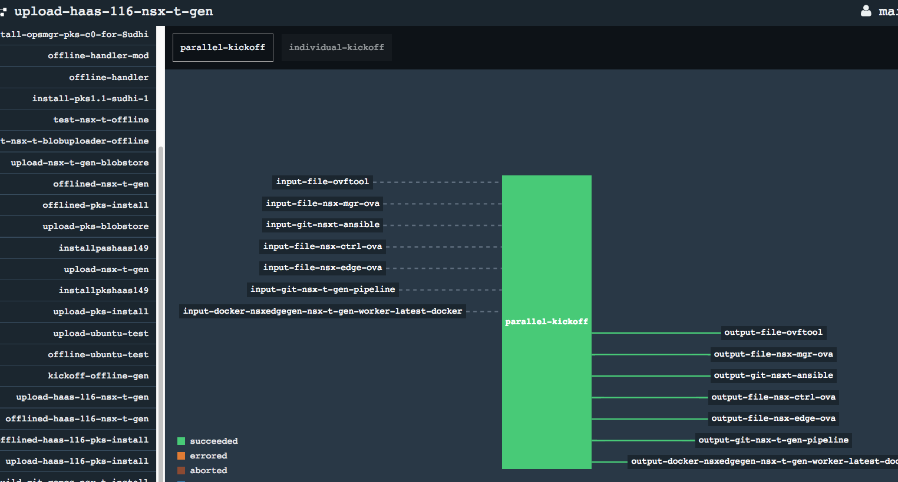</div>
  * Blobstore Upload
  <div>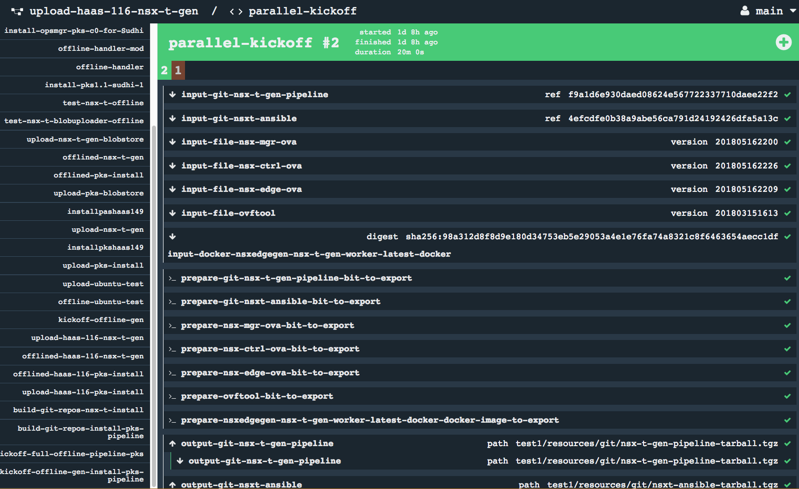</div>
  * S3 Blobstore Pivnet Tiles
  <div>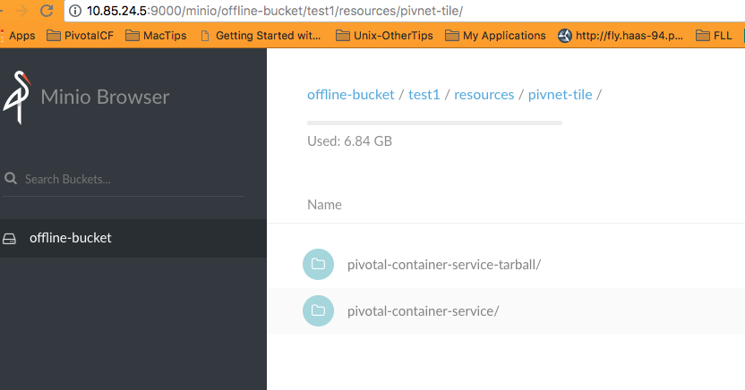</div>
  * S3 Blobstore Docker images
  <div>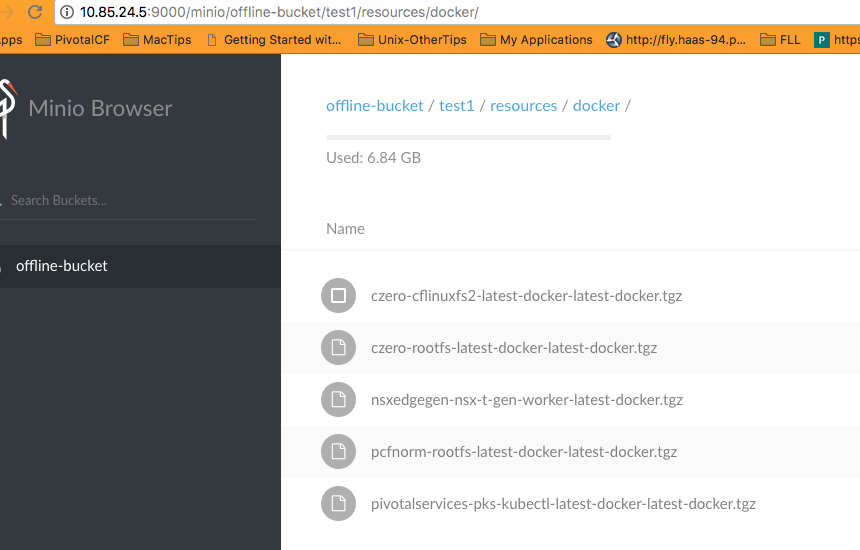</div>

* Running the offlined version of target pipeline would execute the same jobs and tasks as the original pipeline, while referring to the resources saved in the S3 Blobstore from previous step.
  * Offline Pipeline
  <div>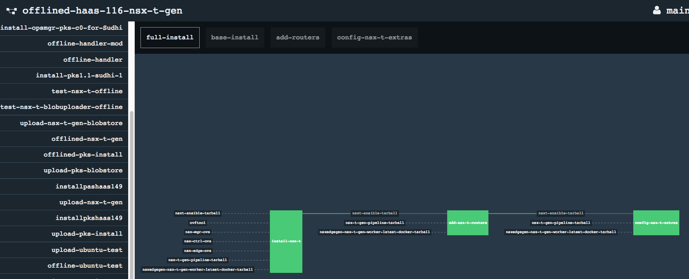</div>
  * Offline Pipeline Resource retrieval
  <div>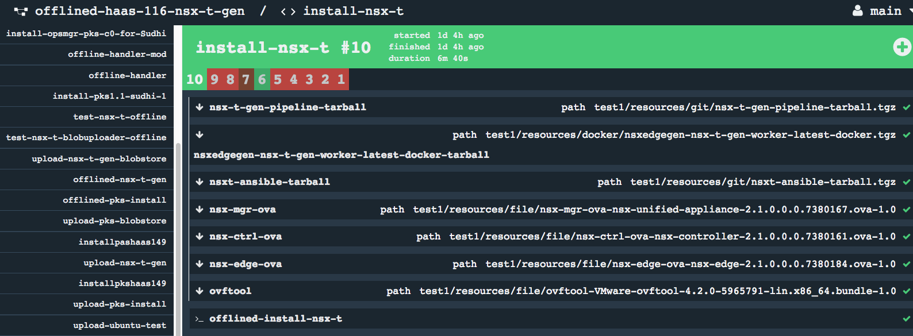</div>

# Notes
* Make sure the `offline_run_id` in the main input.yml for offline-gen is unique to distinguish across different pipelines/runs. Using the same `offline_run_id` can lead to conflicts or collision of values/folders/files.
* Automatic run of the blobstore upload pipeline might fail if the supplied params are incomplete. Best to save the pipeline and run it separately with the right parameters so correctly versioned artifacts can be saved into the S3 blobstore.
* If changes are not getting reflected (like switching branches or target pipeline changes), things might be getting cached. Delete the main offline-gen folder (under s3-bucket/run-name/resources/) from the S3 blobstore, destroy and re-register the kickoff-offline-<pipeline-name> and start-full-generation-for-<pipeline-name> pipelines and regenerate the offline and blostore store upload pipelines from scratch by running the newly registered kickoff and start-full-gen pipelines.

# Running offline-gen directly from command line

Requires python libraries specified in requirements.txt

* Basic usage: ```python offline-generator.py <target-pipeline-repo-path> input.yml```

  Expect the target-pipeline repo to be locally present and generate full upload and offlined pipeline versions

  See sample `sample_input.yml` template under `templates` folder for input file structure (specifies the s3 configs, pipeline file path, other general configs)

* Git repo first pass: ```python offline-generator.py -git <target-pipeline-repo-path> input.yml```

  Would generate a new pipeline that would only represent git repos to be analyzed for next step.
* Analysis pass:  ```python offline-generator.py -analyze <target-pipeline-repo-path> input.yml```
  Would generate a full report of the various docker images used by the tasks within a given pipeline across various jobs and tasks
  Sample report:
  ```
    docker_list:
  - {repository: nsxedgegen/nsx-t-gen-worker}
  pipeline_task_docker_references:
    nsx-t-gen-pipeline:
      docker_references:
      - {repository: nsxedgegen/nsx-t-gen-worker}
      git_path: https://raw.githubusercontent.com/sparameswaran/nsx-t-gen/master/
      task_defns:
      - install-nsx-t:
          file: tasks/install-nsx-t/task.yml
          image: {repository: nsxedgegen/nsx-t-gen-worker}
          inputs:
          - {name: nsx-t-gen-pipeline}
          - {name: nsx-mgr-ova}
          ....
          - {name: ovftool}
          outputs: null
          script: nsx-t-gen-pipeline/tasks/install-nsx-t/task.sh
       .....
    nsxt-ansible:
      docker_references: []
      git_path: https://raw.githubusercontent.com/sparameswaran/nsxt-ansible/master/
      task_defns: []
    target-pipeline:
      docker_references: []
      git_path: pipeline
      job_tasks_references:
      - install-nsx-t:
        - {file: nsx-t-gen-pipeline/tasks/install-nsx-t/task.yml, git_resource: nsx-t-gen-pipeline,
          task: install-nsx-t}
      task_defns: []
  ```

# Limitations

* Requires Concourse install to use basic auth (to auto-register and execute dynamically generated concourse pipelines)
* The blobstore upload portion requires access to online resources (to pull github repos, docker images, pivnet tiles etc) as well as Pivotal Network Token to download tiles/products. So, the automatic run of the blobstore upload pipeline might fail if the supplied params are incomplete. Best to save the pipeline and run it separately with the right parameters so correctly versioned artifacts can be saved into the S3 blobstore.
* Use unique `offline_run_id` id to distinguish pipelines, artifacts across various runs (as already mentioned).
* Download of parameterized resources like github repos with dynamic branch specified as parameter requires the kickoff portion to have access to the github branch as parameter. For tile or product that requires version parameters to be supplied during actual execution, these need to be supplied during blobstore upload pipeline execution to save the correct matching versions into S3 blobstore.
