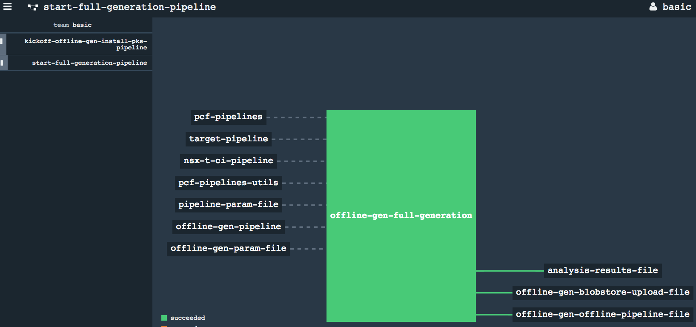
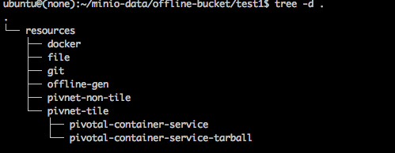

# Offline-gen

Offline Generator of Concourse pipelines

Creates two separate pipelines that handle:
* Upload of all the contents referred by a concourse pipeline to S3 Blobstore
  * Github repositories
  * Docker images (as tarballs)
  * Files or nested folders (as tarballs for multiple files)
  * Pivnet Tiles (with stemcells)
  * Non-Pivnet Tiles (like Ops Mgr Ova file)
* Offline Pipeline that uses only offlined version of resources saved in S3 Blobstore

# Running as a Concourse pipeline

Register the offline-gen pipeline with Concourse (requires basic auth to kick off other dependent pipelines). A Blobstore upload pipeline and offline versioned form of the actual pipeline would be generated.

```
# Concourse target
export CONCOURSE_TARGET=concourse-test

# MODIFY based on run/target pipeline
export OFFLINE_GEN_PIPELINE_NAME=kickoff-offline-gen-test-pipeline

# Use the provided kickoff-offline-gen-pipeline.yml template
export OFFLINE_GEN_PIPELINE=kickoff-offline-gen-pipeline.yml

# All offline-gen parameters go here (like s3 blobstore details, run name,
#                                 target pipeline github repo, pipeline file)
export OFFLINE_GEN_INPUT_PARAM_FILE=offline-gen-input-params.yml

# Any additional target pipeline parameters go here (like github branches)
export TARGET_PIPELINE_INPUT_PARAM_FILE=target-pipeline-params.yml

fly -t $CONCOURSE_TARGET set-pipeline \
    -p $OFFLINE_GEN_PIPELINE_NAME \
    -c $OFFLINE_GEN_PIPELINE \
    -y "offline_gen_yaml_input_params=$(cat $OFFLINE_GEN_INPUT_PARAM_FILE)" \
    -y "pipeline_yaml_input_params=$(cat $TARGET_PIPELINE_INPUT_PARAM_FILE)" \
    -l input.yml \
    -l extra-params.yml
```

Use the `sample_input.yml` to create a new input file that would contain configs for talking to a S3 Blobstore, name, branch, github repo of the target pipeline and associated pipeline that needs to be offlined. The pipeline-params file can contain parameter values pertaining to the target pipeline itself (IaaS/branch etc).

Parameters specified in the pipelines would be preseved as is.

# Stages

* Register the `kickoff-offline-gen-pipeline.yml` pipeline
  * Init
  
* Execution of it would create a new pipeline for handling full generation of the blobstore upload and offlined pipelines.
  * Kickoff Execute
  
  * Start of registering full Generation
  
  * Kickoff Complete
  
  * Full Generation of upload and offline pipelines
  
* S3 buckets would be filled with requisite files required for the offline-gen to function (parameter files, settings)
    * S3 Blobstore
    
    * S3 Blobstore Structure
    
    * S3 Blobstore upload and Offline pipelines
    
* Blobstore upload pipeline would be saved along with the offline version of the target pipeline
    * S3 Blobstore Pivnet Tiles
    
    * S3 Blobstore Docker images
    
* Running the blobstore upload pipeline would then upload all resources/docker images/files/pivnet tiles/stemcells etc. into the S3 blobstore.
  * Blobstore Upload Pipeline
  
  * Blobstore Upload
  
* Running the offlined pipeline would execute the same jobs and tasks as the original pipeline while referring to the resources saved in the S3 Blobstore from previous step.
  * Offline Pipeline
  
  * Offline Pipeline Resources
  

# Running offline-gen directly from command line

Requires python libraries specified in requirements.txt

* Basic usage: ```python offline-generator.py <target-pipeline-repo-path> input.yml```

  Expect the target-pipeline repo to be locally present and generate full upload and offlined pipeline versions

  See sample `sample_input.yml` template under `templates` folder for input file structure (specifies the s3 configs, pipeline file path, other general configs)

* Git repo first pass: ```python offline-generator.py -git <target-pipeline-repo-path> input.yml```

  Would generate a new pipeline that would only represent git repos to be analyzed for next step.
* Analysis pass:  ```python offline-generator.py -analyze <target-pipeline-repo-path> input.yml```
  Would generate a full report of the various docker images used by the tasks within a given pipeline across various jobs and tasks
  Sample report:
  ```
  docker_list:
- {repository: nsxedgegen/nsx-t-gen-worker}
pipeline_task_docker_references:
  nsx-t-gen-pipeline:
    docker_references:
    - {repository: nsxedgegen/nsx-t-gen-worker}
    git_path: https://raw.githubusercontent.com/sparameswaran/nsx-t-gen/master/
    task_defns:
    - install-nsx-t:
        file: tasks/install-nsx-t/task.yml
        image: {repository: nsxedgegen/nsx-t-gen-worker}
        inputs:
        - {name: nsx-t-gen-pipeline}
        - {name: nsx-mgr-ova}
        ....
        - {name: ovftool}
        outputs: null
        script: nsx-t-gen-pipeline/tasks/install-nsx-t/task.sh
     .....
  nsxt-ansible:
    docker_references: []
    git_path: https://raw.githubusercontent.com/sparameswaran/nsxt-ansible/master/
    task_defns: []
  target-pipeline:
    docker_references: []
    git_path: pipeline
    job_tasks_references:
    - install-nsx-t:
      - {file: nsx-t-gen-pipeline/tasks/install-nsx-t/task.yml, git_resource: nsx-t-gen-pipeline,
        task: install-nsx-t}
    task_defns: []
  ```

# Limitations

* Requires Concourse install to use basic auth (to auto-register and execute dynamically generated concourse pipelines)
* The blobstore upload portion requires access to online resources (to pull github repos, docker images, pivnet tiles etc) as well as Pivotal Network Token to download tiles/products.
* Download of parameterized resources like github repos with dynamic branch specified as parameter requires the kickoff portion to have access to the github branch as parameter. For tile/prduct versions requires the parameters to be supplied during actual execution, these need to be supplied during blobstore upload pipeline execution to save the matching versions into S3 blobstore.
